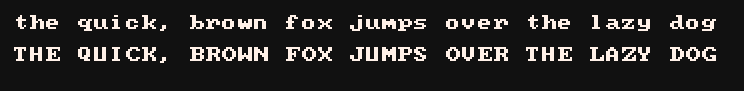
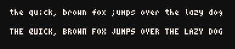
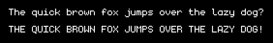

# Pixel Font for Litecanvas

A simple plugin to let you render a pixel font to emulate retro vibes in your [Litecanvas](https://github.com/litecanvas/game-engine) projects.

<!-- prettier-ignore -->
> [!TIP]
> **This plugin is automatically loaded on Litecanvas [playground](https://litecanvas.js.org/).**

## Install

```sh
npm i @litecanvas/plugin-pixel-font
```

or

```html
<script src="https://unpkg.com/@litecanvas/plugin-pixel-font"></script>
```

## Usage

```js
import litecanvas from 'litecanvas'
import pluginPixelFont, {
  PIXEL_FONT_BASIC,
  PIXEL_FONT_MINI,
} from '@litecanvas/plugin-pixel-font'

litecanvas({
  loop: { draw },
})

use(pluginPixelFont)

function draw() {
  cls(0)

  // activate the default pixel font 8x8
  textfont(PIXEL_FONT_BASIC)

  // or activate the mini pixel font 4x6
  // textfont(PIXEL_FONT_MINI)

  // set the text pixel scale to 300%
  textsize(3)

  // now render your pixelated text
  text(0, 0, 'Hello World')

  // reset the font renderer
  textfont('sans-serif')
  text(0, 50, 'Text with browser font')
}
```

[See this example on playground](https://litecanvas.js.org?c=eJxtj8FqwzAMhu95Ct3iwEYL3UavW2lpYOsGK2y34sUKNbj2kJUmW%2Bm7z3YayKCggwSfvl8ymrGS9ii9OJ2LLKsbW7F2FhTJVhRwygAq48W0CE2oyQRkAI6SEXiPoLCWjWH41h0aqJ1lmHfzADJ2HEfxVn4un3er18129%2FT4Xi5CSNI4%2Bm86aKvHmrvuoQevmV7KTTmIPHISRA68%2FsVLemzFbKCsa4HQKiT4cQ31SSFbJfayIqY3ECpfozEOPhwZlQ8CwiEonde7kMav5l5af%2BuRdJ0XI%2BV9dG7jea3mPXyRawOUPIE7%2FwFzJ3ng)

## API

### `function text(x: number, y: number, str: string, color?: number): void`

Draw a pixelated text in the position (x, y) using color white (3) by default.

> Note: The `text()` 5th param for text style (bold, italic, etc) is disabled in the pixel font.

### `function textsize(value: number): void`

Sets the **pixel scale** (not the font size). E.g.: `textsize(3)` scales the pixel font in 3x or 300%.

### `const PIXEL_FONT_BASIC`

The variable that contains information about the pixel font 8x8. Use it as a font family to activate the plugin.



### `const PIXEL_FONT_MINI`

The variable that contains information about the pixel font 4x6. Use it as a font family to activate the plugin.



### `const PIXEL_FONT_MONOGRAM`

The variable that contains information about the monogram font 6x9. Use it as a font family to activate the plugin.


